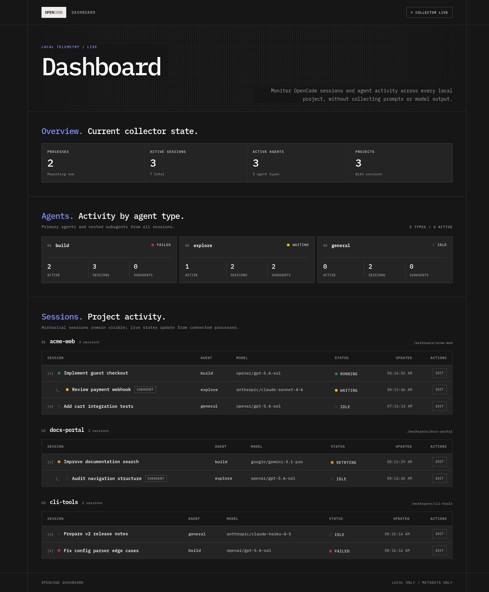
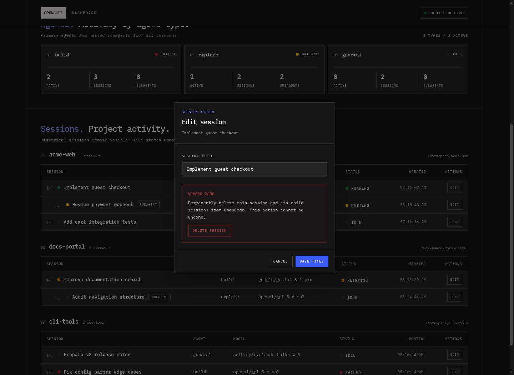

<div align="center">


# OpenCode Dashboard

**A private, local dashboard for OpenCode sessions, projects, and agent activity.**

Open the dashboard from the TUI with `/dashboard`. No prompts, responses, or tool payloads leave your machine.

</div>



> [!NOTE]
> The screenshots use fictional projects, paths, sessions, and models. No user data is included.

## Why OpenCode Dashboard?

OpenCode Dashboard gives you one browser view of activity across every local OpenCode project. It combines live process updates with persisted session history, so active work and older sessions remain easy to find.

- Monitor running, waiting, retrying, idle, failed, and stale sessions.
- Browse sessions by project, including parent and subagent relationships.
- See agent usage, active counts, models, and recent activity.
- Rename or delete sessions through the connected OpenCode process.
- Retain dashboard state in the browser between collector restarts.



## Privacy

The dashboard runs entirely on your machine and binds to `127.0.0.1:4747`.

It collects session metadata only:

| Included | Never collected |
| --- | --- |
| Session ID and title | Prompts and responses |
| Project name and local directory | Model reasoning |
| Agent, model, status, and timestamps | Tool inputs and outputs |
| Parent/child session relationships | Credentials and environment variables |

Nothing is sent to an external telemetry or storage service.

## Requirements

- [OpenCode](https://opencode.ai/) `1.18.30` or newer
- [Bun](https://bun.sh/) for installation from source
- A browser available through your operating system's default URL opener

## Installation

OpenCode Dashboard is installed as a [local plugin](https://opencode.ai/docs/plugins/#from-local-files). Clone it into your OpenCode configuration directory and build it:

```bash
git clone https://github.com/RayXpub/opencode-dashboard.git ~/.config/opencode/opencode-dashboard
cd ~/.config/opencode/opencode-dashboard
bun install --frozen-lockfile
bun run build
```

OpenCode loads server and TUI plugins separately. Add their local entrypoints to both global configuration files. These paths are relative to `~/.config/opencode/`, so they work without machine-specific absolute paths.

`~/.config/opencode/opencode.json`:

```json
{
  "$schema": "https://opencode.ai/config.json",
  "plugin": [
    "./opencode-dashboard/dist/server/index.js"
  ]
}
```

`~/.config/opencode/tui.json`:

```json
{
  "$schema": "https://opencode.ai/tui.json",
  "plugin": [
    "./opencode-dashboard/dist/tui/index.js"
  ]
}
```

Preserve any plugins already present in those arrays. Restart OpenCode after changing either file.

## Usage

Run the following slash command from the OpenCode TUI:

```text
/dashboard
```

The command starts or reconnects to the local collector, synchronizes persisted sessions across projects, and opens `http://127.0.0.1:4747` in your default browser.

The dashboard remains available while the OpenCode TUI that launched its collector is running. Session rename and delete actions require at least one connected OpenCode server process.

## Updating

Pull the latest changes and rebuild the plugin:

```bash
cd ~/.config/opencode/opencode-dashboard
git pull --ff-only
bun install --frozen-lockfile
bun run build
```

Restart OpenCode after rebuilding so both plugin entrypoints are reloaded.

## Troubleshooting

### `/dashboard` is unavailable

Confirm the TUI entrypoint is present in `~/.config/opencode/tui.json`, then fully quit and restart OpenCode. Configuration-time plugins are not hot-reloaded.

### The dashboard does not open

Visit `http://127.0.0.1:4747` directly. If it is unavailable, check whether another application already uses port `4747` and review the OpenCode logs for plugin errors.

### Rename or delete is unavailable

Session actions are relayed through a connected OpenCode server plugin. Confirm the server entrypoint is present in `~/.config/opencode/opencode.json` and restart OpenCode.

## Development

```bash
bun install --frozen-lockfile
bun run dev
```

Run the complete quality suite before submitting a change:

```bash
bun run lint
bun run typecheck
bun test
bun run build
```

User-facing changes require a Changeset:

```bash
bun run changeset
```

The package is private. Releases consist of version updates, changelog entries, Git tags, and GitHub releases; the release process never publishes to npm.
